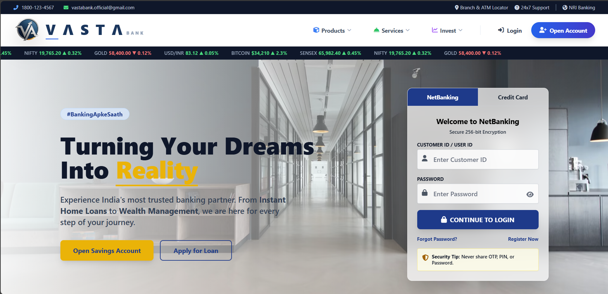
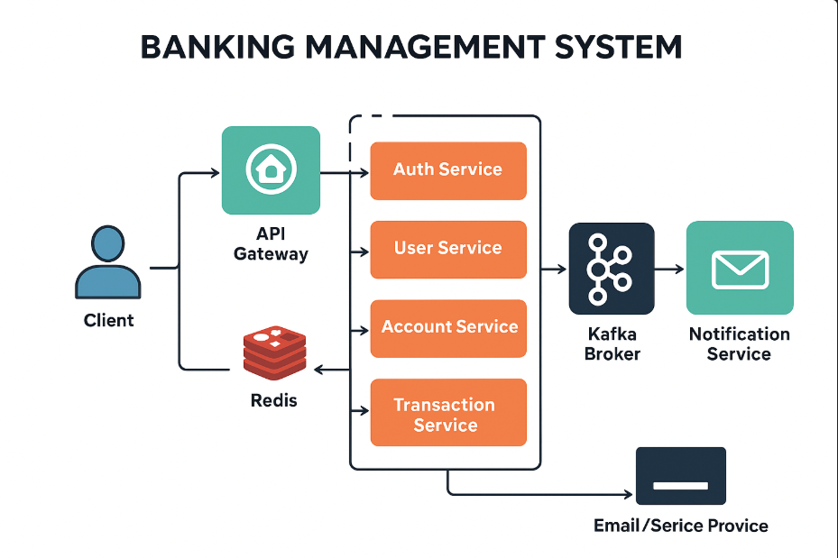
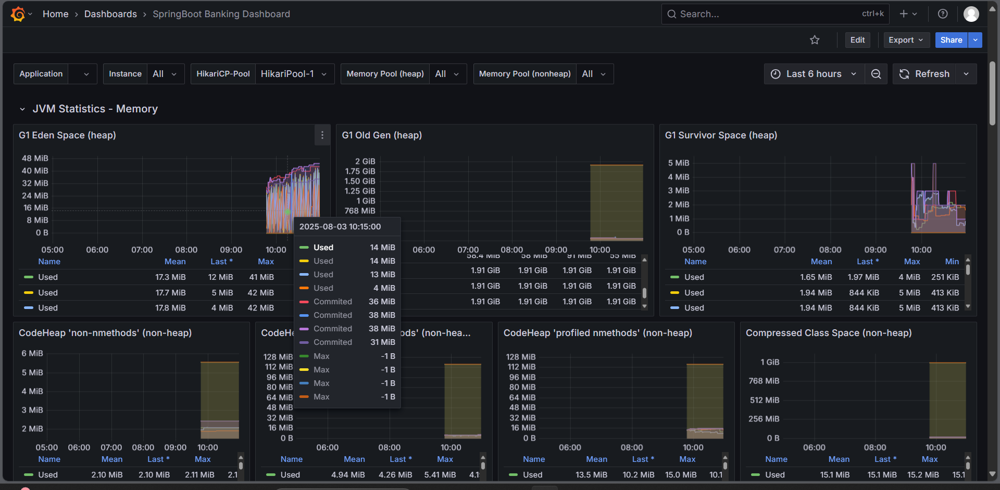
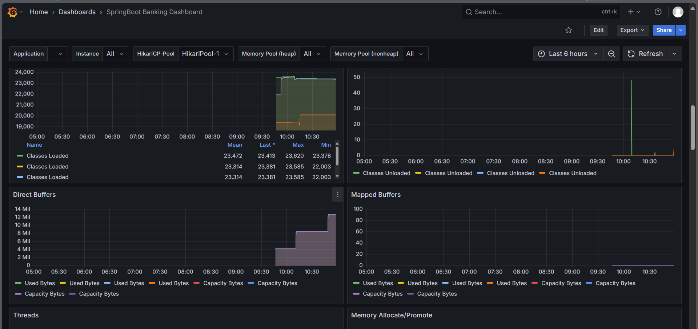

# 🏦 VASTA Bank

### Enterprise-Grade Full-Stack Banking Platform

<p align="center">
  
</p>
<p align="center">
  <b>A modern, secure, scalable digital banking system built using Microservices, Event-Driven Architecture, and Cloud-Native principles.</b>
</p>

<p align="center">
  <a href="https://vasta-bank.vercel.app/">🌐 Live Demo</a> •
  <a href="assets/">📖 Backend Docs</a> •
  <a href="https://github.com/Akash-Adak/VASTA-Bank/issues">🐞 Issues</a>
</p>

---

## 🚀 Project Overview

**VASTA Bank** is a **real-world inspired enterprise banking platform** that simulates how modern banks are built today.

It is **not a CRUD demo** — it includes:

* Secure authentication
* Real money flow logic
* Kafka-based event processing
* Monitoring with Grafana & Prometheus
* Full frontend + backend + DevOps setup

Designed for:

* **Backend / Full-Stack interviews**
* **Microservices learning**
* **System design demonstration**
* **FinTech-grade architecture understanding**

---

## 🧠 Key Highlights (Why This Project Stands Out)

✔️ Full-stack (React + Spring Boot)
✔️ Microservices with real boundaries
✔️ Kafka event-driven communication
✔️ JWT RS256 security (bank-grade)
✔️ Dockerized end-to-end setup
✔️ Monitoring & observability
✔️ Production-style architecture

---

## ▶️ Run the Project (Docker Compose)

This project is fully **Dockerized**. You can run the entire banking system using **one command**.

### Prerequisites

* Docker
* Docker Compose
* Git

### Setup & Run

```bash
git clone https://github.com/Akash-Adak/VASTA-Bank.git
cd VASTA-Bank
docker-compose up -d
```

⏳ First startup may take a few minutes.

### Services Started

* API Gateway
* Eureka Server
* Auth, User, Account, Transaction, Loan, Notification Services
* MySQL, Redis
* Kafka, Zookeeper
* Prometheus, Grafana

### Access URLs

| Service             | URL                                            |
|---------------------|------------------------------------------------|
| Auth server         | [http://localhost:8081](http://localhost:8081) |
| User server         | [http://localhost:8082](http://localhost:8082) |
| Account server      | [http://localhost:8083](http://localhost:8083) |
| Transaction server  | [http://localhost:8084](http://localhost:8084) |
| Notification server | [http://localhost:8085](http://localhost:8085) |
| Loan server         | [http://localhost:8086](http://localhost:8086) |
| Eureka Dashboard    | [http://localhost:8761](http://localhost:8761) |
| Grafana             | [http://localhost:3000](http://localhost:3000) |
| Prometheus          | [http://localhost:9090](http://localhost:9090) |

### Stop Services

```bash
docker-compose down
```


## 🖥️ Frontend (React)

<p align="center">
  
</p>

**Frontend Stack**

* React
* Tailwind / CSS
* JWT-based auth flow
* Role-based UI
* Secure API consumption via Gateway

**Features**

* User registration & login
* Account dashboard
* Fund transfers
* Transaction history
* Loan application & tracking
* Admin panels (role-based)

---

## 🏗️ Backend Architecture (Microservices)

<p align="center">
  
</p>

### Core Services

| Service                  | Responsibility                         |
| ------------------------ | -------------------------------------- |
| **API Gateway**          | Routing, JWT validation, rate limiting |
| **Auth Service**         | Login, JWT (RS256), refresh tokens     |
| **User Service**         | Profile & KYC management               |
| **Account Service**      | Bank accounts & balances               |
| **Transaction Service**  | Transfers, validation, history         |
| **Loan Service**         | Loan lifecycle & EMI                   |
| **Notification Service** | Email / SMS / in-app alerts            |
| **Eureka Server**        | Service discovery                      |

---

## 🔐 Security (Bank-Grade)

* JWT Authentication (RS256)
* Role-Based Access Control
* Redis-backed token management
* Password hashing (BCrypt)
* Transaction OTP for high-value transfers
* Rate limiting & IP tracking

---

## 📡 Event-Driven System (Kafka)

[//]: # (<p align="center">)

[//]: # (  )

[//]: # (</p>)

Kafka topics used:

* `transaction.events`
* `account.events`
* `loan.events`
* `notification.events`
* `audit.events`

✔️ Async processing
✔️ Loose coupling
✔️ High scalability

---

## 📊 Monitoring & Observability

<p align="center">
  
  
  
</p>

**Monitoring Stack**

* Prometheus – Metrics collection
* Grafana – Dashboards & alerts
* Spring Boot Actuator

**Tracked Metrics**

* Request latency
* Error rates
* Kafka consumer lag
* JVM memory & CPU
* Business metrics (transactions/sec)

---

## 🐳 DevOps & Deployment

[//]: # (<p align="center">)

[//]: # (  )

[//]: # (</p>)

* Dockerized microservices
* One-command startup
* Environment-isolated services
* Ready for Kubernetes migration

```bash
docker-compose up -d
```

---

## 🧪 Testing & Reliability

* Unit tests for business logic
* Integration tests between services
* DB transactions & pessimistic locking
* Retry & dead-letter queues in Kafka

---

## 🧩 Tech Stack

**Backend**

* Java 17
* Spring Boot 3.x
* Spring Security
* Spring Cloud (Gateway, Eureka)
* Kafka
* MySQL
* Redis

**Frontend**

* React
* Tailwind / CSS
* Axios
* JWT Auth

**DevOps**

* Docker
* Docker Compose
* Prometheus
* Grafana

---

## 👨‍💻 What This Project Proves

This project demonstrates:

* Real backend engineering skills
* Understanding of distributed systems
* Production-level security
* DevOps & monitoring knowledge
* End-to-end ownership mindset

---

## 🤝 Contribution & Feedback

Contributions, feedback, and reviews are welcome.
If you’re an interviewer or reviewer — feel free to explore deeply.

---

## 📄 License

MIT License

---

